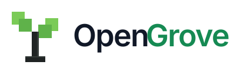
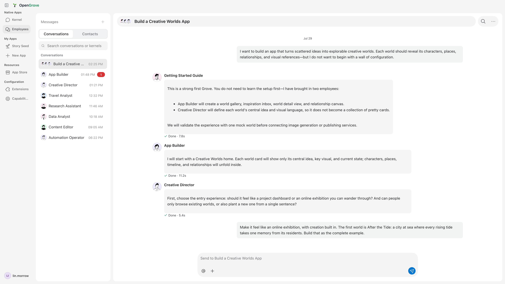
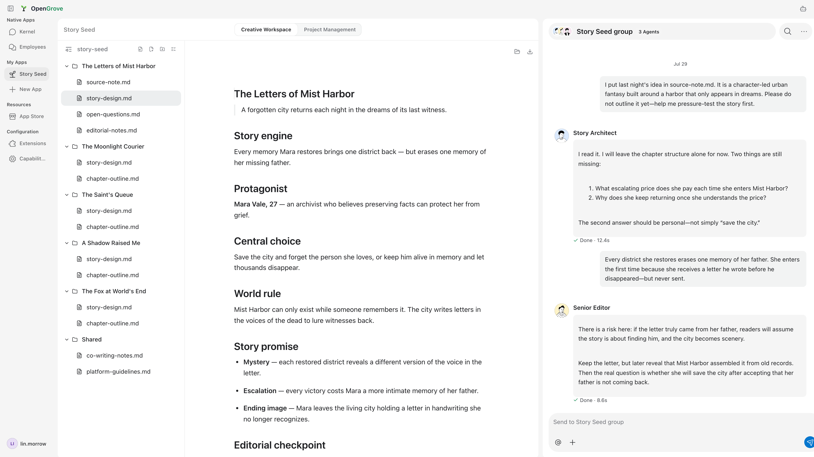

<p align="center">
  
</p>

<h3 align="center">Turn your coding agents into a team of AI employees.</h3>

<p align="center">
  <a href="https://github.com/open-grove/opengrove/stargazers"></a>
  <a href="LICENSE"></a>
  
  <a href="https://opengrove.io"></a>
</p>

<p align="center">
  English · <a href="README.zh-CN.md">简体中文</a>
</p>

<p align="center">
  <a href="#quickstart">Quickstart</a> ·
  <a href="#why-opengrove">Why OpenGrove</a> ·
  <a href="#features">Features</a> ·
  <a href="#supported-kernels">Kernels</a> ·
  <a href="#architecture">Architecture</a> ·
  <a href="docs/reference/TECHNICAL_REFERENCE.md">Full Docs</a>
</p>

---

You already have powerful agents — Codex, Claude Agent, Hermes, Pi, OpenCode. What you don't have is a team. Today *you* are the messenger between them: re-pasting context, replaying decisions, babysitting five terminals.

OpenGrove hires them instead. Each agent becomes an **employee** with a name, a role, and instructions. You talk to them in **Rooms** — `@` an App Builder, loop in a Creative Director, watch them hand work to each other — and approve anything risky before it happens. Install an **App** and your team gets an entire practice in one directory: employees, skills, tools, workspace files.

<p align="center">
  
</p>

This is the open-source foundation of a **Grove** — a company run by one owner and a team of AI employees. OpenGrove stores its Rooms, Apps, workspace state, and Provider configuration locally on your machine. Model requests still go to the Kernels and Providers you configure, and some Apps may connect to hosted services as described below.

> **Status:** Actively developed. Interfaces and App contracts may still change between releases.

## Quickstart

**Download the desktop app** — macOS (Apple Silicon / Intel) and Windows x64 installers ship with every [GitHub Release](https://github.com/open-grove/opengrove/releases/latest), alongside a `SHA256SUMS.txt` for verification.

> Windows installers are not yet Authenticode-signed, so Microsoft Defender SmartScreen may warn on first download or launch.

To run the desktop app from source:

```bash
git clone https://github.com/open-grove/opengrove.git
cd opengrove
npm ci
npm start
```

To run the local browser UI from the same checkout instead:

```bash
npm run bridge:web
```

Then open **http://127.0.0.1:37371/ui/**.

For an API-only local Bridge/CLI:

```bash
npm run build:server
node dist/cli.js start
```

## Why OpenGrove

- **Local runtime and data.** The UI, Bridge, Rooms, Apps, Kernel runtimes, and Provider configuration live on your machine. Your employees work directly against *your* files; OpenGrove does not require an OpenGrove-hosted agent runtime. Configured Kernels and Providers may still send prompts and context to their own services.
- **Bring your own agents and keys.** OpenGrove doesn't replace Codex, Claude Agent, or any other kernel — it hosts them side by side, each with its own model loop, tools, and prompting rules. Providers connect through a bundled [Models.dev](https://models.dev) catalog, or bring any compatible endpoint. No lock-in at either layer.
- **A team, not a terminal.** Rooms give your employees shared context, `@`-routing, replies, and approvals — so multi-agent work looks like collaboration, not copy-pasting between CLIs.
- **Apps make it composable.** An OpenGrove App is a portable directory bundling employees, skills, tools, MCP config, and workspace files. Install one from the Store, mount it, customize it locally, or publish your own.

<p align="center">
  
  <br />
  <sub>The Story Seed App: employees critique a story design in a group chat while the shared workspace updates beside them.</sub>
</p>

## Features

- **Multi-kernel** — switch between Codex, Claude Agent, Hermes, Pi, OpenClaw, OpenCode, and Kimi from one UI
- **Rooms** — direct chats, group conversations, threaded replies, `@` mentions that route to specific employees
- **OpenGrove Apps** — install, mount, and publish portable app directories that bundle employees, skills, CLIs, MCP config, App-owned MCP views, workspace files, and developer preview sessions
- **App Store & Release Control** — versioned installs and updates with validation, rollback, and release gating
- **Approvals** — file changes, shell commands, and risky actions require explicit sign-off
- **Bilingual UI** — complete English and Simplified Chinese coverage with live language switching
- **Browser extension** — send page context and selections straight into a conversation
- **Provider freedom** — connect major model providers through the bundled Models.dev catalog, or add your own compatible endpoint

## Supported Kernels

| Kernel | Integration |
| --- | --- |
| Codex | JSON-RPC app-server, native events & approvals |
| Claude Agent | Anthropic Agent SDK streaming |
| Hermes | TUI Gateway over stdio JSON-RPC |
| Pi | SDK in-process |
| OpenClaw | Gateway WebSocket |
| OpenCode | ACP over stdio |
| Kimi CLI | ACP over stdio |

The bundled Claude kernel is the default. Select another installed kernel with:

```bash
OPENGROVE_KERNEL=codex node dist/cli.js start
```

## Local Runtime and Data

OpenGrove keeps its workspace runtime and core data on this machine: the UI,
Bridge, Rooms, Apps, Kernel runtimes, and Provider configuration are local.

The desktop app runs the same local bridge behind an Electron shell. It stores
state in the OS app-data directory, uses a random loopback port plus an
in-memory bridge token, and does not import legacy persisted state from a
repository-local `data/` directory. Legacy state files already inside the
selected app-data directory are migrated in place when supported.

App Store installs are local installs. A registry can list downloadable App
packages, but OpenGrove downloads and unpacks them directly into the local data
directory. App employees, `AGENTS.md`, skills, tools, hooks, and workspace files
load from that local installation, so employee edits continue to modify files on
this machine.

Some Apps connect a Grove to real-world marketplaces — for example, Story Seed
routes real story commissions to your employees. Order review, contracting, and
settlement for those marketplaces run on OpenGrove's hosted services. OpenGrove
Cloud API, internally codenamed **WW**, also provides accounts and hosted
Providers; OpenGrove Release Control provides the App Store catalog, packages,
publishing, and formal versions. These hosted services are outside this
repository and do not own the local workspace, native Kernel sessions, or
installed App files.

### Background network access and account activity

- **Update checks and downloads.** A packaged desktop periodically asks
  OpenGrove Cloud for the latest release and may download update assets when
  automatic downloads are enabled. Signed-in sessions use the full version
  contract; signed-out desktops use its unauthenticated public endpoint. A
  desktop running from a source checkout instead periodically fetches its
  configured Git remote to check for source updates.
- **Signed-in account maintenance.** Restoring a saved account session may
  refresh its tokens, read the account profile, reconcile the hosted Provider
  credential, and read the default-App install policy and catalog. These calls
  maintain features attached to the signed-in account; they are not activity
  telemetry.
- **Configured integration discovery.** At startup and every six hours, the
  Bridge may refresh model catalogs for configured OpenAI or Anthropic
  Providers and rediscover a configured OpenClaw Gateway. Kernels, Providers,
  and installed Apps can make additional requests according to their
  configuration and the features you use.
- **Daily account activity.** A signed-in Electron desktop attempts this report
  at most once per account per UTC day, and only while the window is in the
  foreground: surface (`desktop`), operating system, CPU architecture, client
  version and optional release number, Bridge version and optional release
  number, and release channel. It carries no chat content, file paths, workspace
  data, or Provider credentials. Signed-out desktops never send it.

Feature actions such as account sign-in, hosted model requests, App Store
actions, and marketplace Apps add their corresponding network requests. Chat
history, Rooms, the knowledge vault, and workspace files are not uploaded by
the Host as part of the background activity report.

## Architecture

```text
┌─────────────────────────────────────┐
│  Desktop / React UI / Extension     │
└──────────────┬──────────────────────┘
               │
┌──────────────▼──────────────────────┐
│  Local Bridge  (127.0.0.1:37371)    │
│  ─ rooms & server-backed ledger     │
│  ─ approvals, artifacts, events     │
│  ─ mounted Apps & App Store         │
│  ─ employees, skills, routines      │
└──────────────┬──────────────────────┘
               │
┌──────────────▼──────────────────────┐
│  Kernel Adapters                    │
│  Codex (JSON-RPC) · Claude (SDK)    │
│  Hermes (Gateway) · Pi (in-process) │
│  OpenClaw (WebSocket) · ACP CLIs    │
│  Structured stream JSON CLIs        │
└─────────────────────────────────────┘
```

Each Kernel keeps its own model loop, tools, and prompting rules. Rooms, Apps, and OpenGrove runtime state are stored locally.

## CLI

Public npm publication is currently disabled. Build the server first, then
invoke the CLI entrypoint directly from a source checkout:

```bash
npm run build:server
node dist/cli.js start              # Start local bridge/API
node dist/cli.js app inspect <src>  # Inspect / scaffold / validate Apps
node dist/cli.js employee pack <id> # Package and publish Rooms employees

npm run build:web                   # Required before serving the browser UI
OPENGROVE_ENABLE_BROWSER_UI=1 node dist/cli.js start
```

The authenticated `web` profile additionally requires `OPENGROVE_WW_BASE_URL`;
see [Building from Source](docs/development/BUILDING.md).

## Configuration

Create `~/.opengrove/.env.local` or `./.env.local`:

```bash
OPENGROVE_KERNEL=claude-code
OPENAI_API_KEY=sk-...
```

See the [full technical reference](docs/reference/TECHNICAL_REFERENCE.md) for all environment variables, Bridge API endpoints, data paths, and advanced options.

## Contributing

```bash
npm ci
npm run check        # static contracts + types + browser UI
npm run build
npm run test:unit
npm run test:integration
npm run test:harness # full pre-release regression
```

See [CONTRIBUTING.md](CONTRIBUTING.md) before opening a PR. CI runs static
checks, Node unit tests, critical integration smoke, and Playwright UI tests.

## Documentation

- [Technical Reference](docs/reference/TECHNICAL_REFERENCE.md) — kernels, providers, Bridge API, rooms & ledger, data paths, troubleshooting
- [Building from Source](docs/development/BUILDING.md) — desktop, browser, authenticated Web, builds, packages, and troubleshooting
- [Kernel Integration](docs/reference/KERNEL_INTEGRATION.md) — adapter boundaries, event mapping, sessions, tools, and harnesses
- [App Spec](docs/product/OPENGROVE_APP_SPEC.md) — mounted App manifest and capability layout
- [Architecture Overview](docs/architecture/OVERVIEW.md) — Host, Kernel, Adapter, Bridge, and App boundaries
- [Release Process](docs/development/RELEASE_PROCESS.md) — versioning, gated installers, and release promotion
- [Product Overview](PROJECT_OVERVIEW.md) — current product boundaries and repository map
- [产品概览 (中文)](PROJECT_OVERVIEW.zh-CN.md)

## License

[Apache License 2.0](LICENSE)
